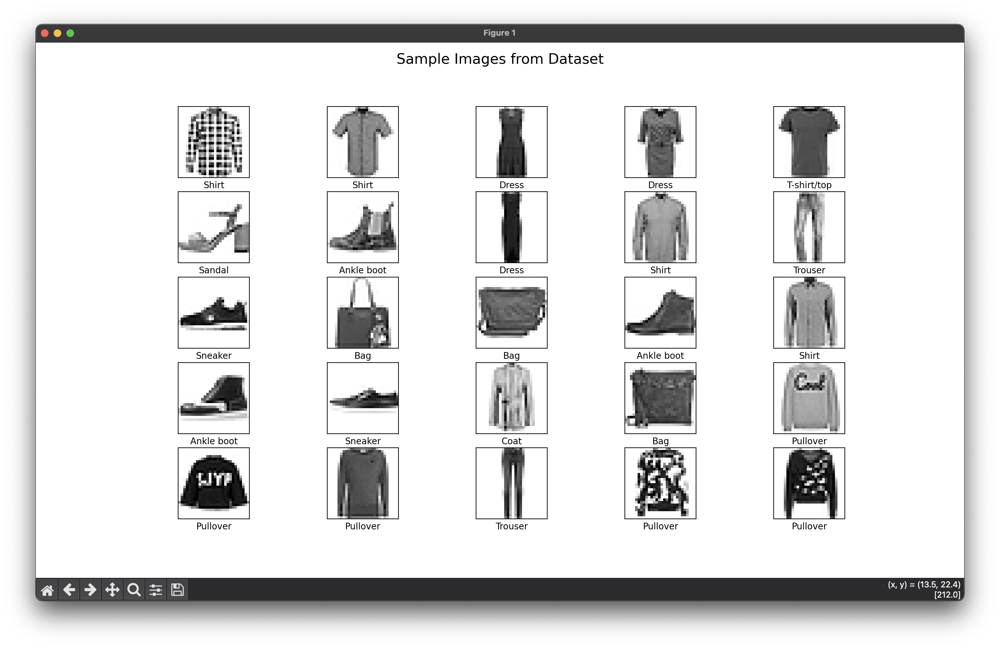
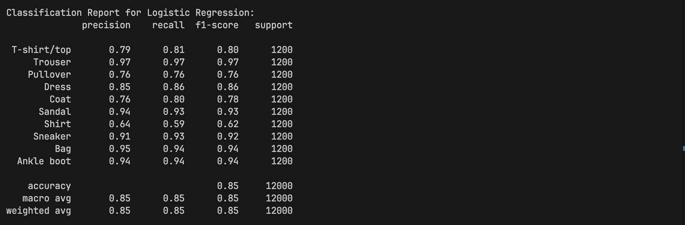
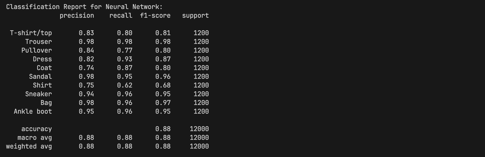
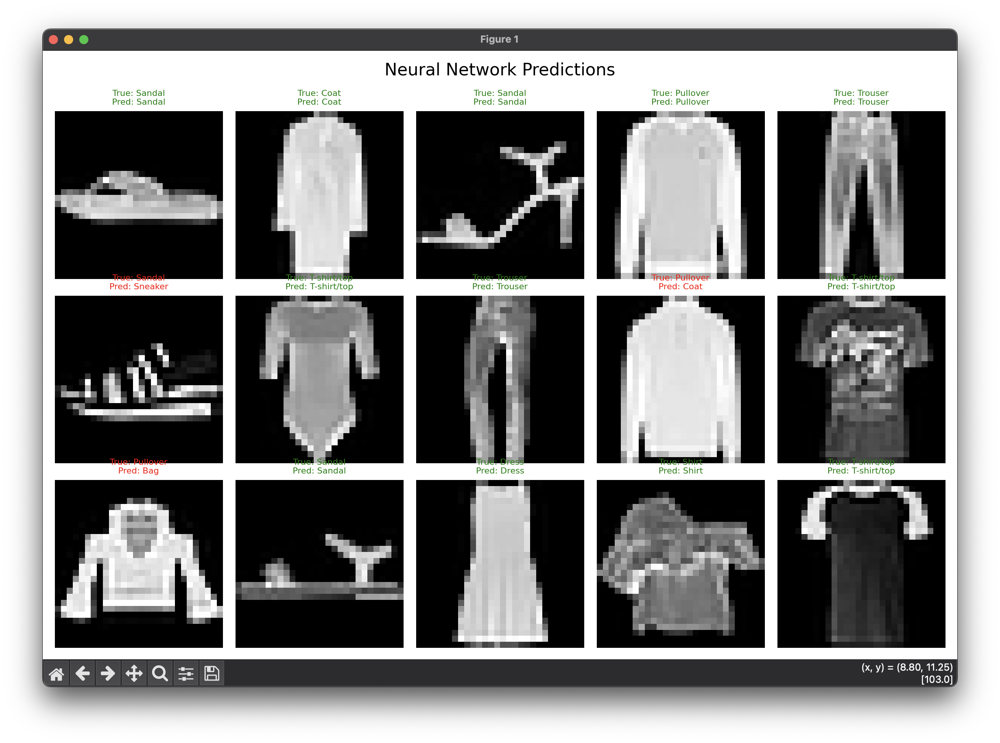
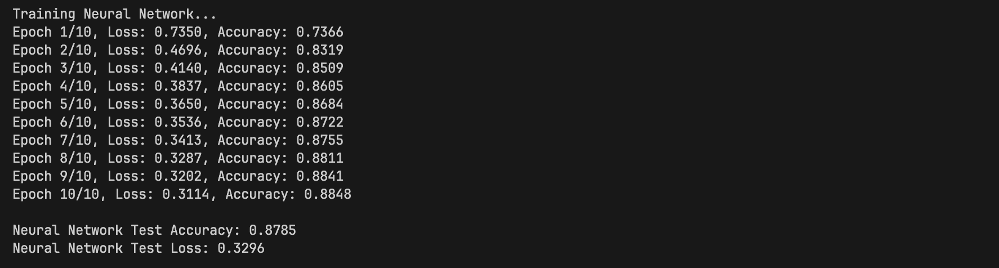
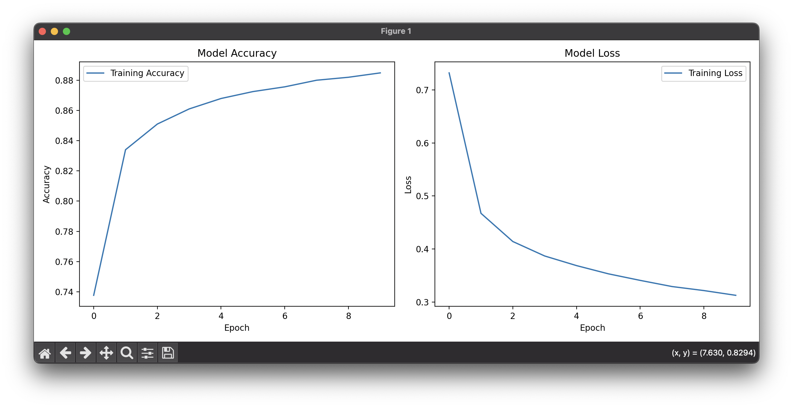

# Image Classification using Neural Networks
## Project Overview
This repository contains a PyTorch implementation for classifying fashion items using the Fashion MNIST dataset or similar grayscale image datasets. The code provides end-to-end functionality for loading data, performing exploratory data analysis, training models, and evaluating their performance.

## Table of Contents
- Dataset
- Model Architecture
- Requirements
- Installation
- Training
- Results

## Dataset 
The dataset contains 10 classes of clothing items:

- 0: T-shirt/top
- 1: Trouser
- 2: Pullover
- 3: Dress
- 4: Coat
- 5: Sandal
- 6: Shirt
- 7: Sneaker
- 8: Bag
- 9: Ankle boot

 


## Model Architecture
# Logistic Regression
A simple linear model that serves as a baseline. It achieves an impressive 85% accuracy on the test set, demonstrating the effectiveness of even basic models on this dataset.

 
 
# Neural Network
A multilayer perceptron with:

- 2 hidden layers (configurable sizes)
- ReLU activation functions
- Batch normalization
- Dropout regularization (30%)

 
 

This more complex model achieves 88% accuracy, providing a modest improvement over logistic regression.


## Requirements

- Python 3.8+
- PyTorch 1.10+
- torchvision
- matplotlib
- numpy
- Seaborn 
- Scikit-learn 

## Installation

To run this project, you need to install the following packages:

```python
pip install numpy
pip install pandas
pip install matplotlib
pip install torch torchvision torchaudio
pip install seaborn
pip install scikit-learn==3.5.0
```

## Training
Training parameters:

- Epochs: 10
- Batch Size: 128
- Learning Rate: 0.001
- Optimizer: Adam




## Results

- Logistic Regression: 85% accuracy on the test set
- Neural Network: 88% accuracy on the test set
   
 
